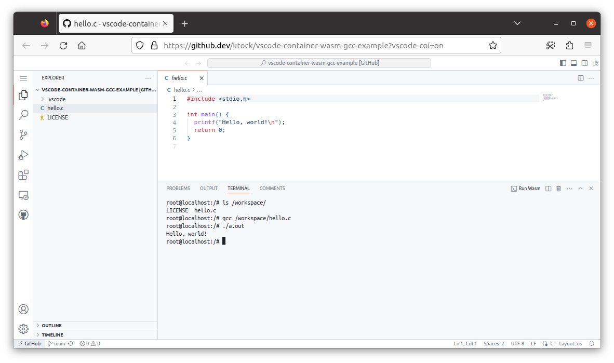

# gcc container on VS Code

Example of https://github.com/ktock/vscode-container-wasm

1. Open this repo on `github.dev` : https://github.dev/ktock/vscode-container-wasm-gcc-example?vscode-coi=on (if using `.` shortcut key, you need to add `?vscode-coi=on` query manually in the URL)
2. Install `ktock.container-wasm` extension.
3. Run `> Run Container On Browser` in the command pallete. Then the container will be launched with the Terminal (can take some time to start the container)



In the container, the workspace is mounted at `/workspace` and you can compile and run [`hello.c`](./hello.c) file.

```console
root@localhost:/# ls /workspace/
LICENSE  hello.c
root@localhost:/# gcc /workspace/hello.c
root@localhost:/# ./a.out
Hello, world!
```

> NOTE: it might take some time to complete compiling the code.

## Container

This will launch the following container.

```dockerfile
FROM debian:sid-slim
RUN apt-get update && apt-get install -y gcc
```

The workspace is visible at `/workspace` in the container.

Note that this extension doesn't require remote container.
This extension downloads the Wasm image converted from the container and runs it in the WebAssembly VM in your browser.

HTTP(S) networking is available in the contaienr with restrictions by the browser (CORS-restricted and no control over [Forbidden headers](https://developer.mozilla.org/en-US/docs/Glossary/Forbidden_header_name)). (see also the project [`README`](../README.md)).

You can customize `settings.json` if you want to load other containers.

## FAQ

### "SharedArrayBuffer is not defined" error occurs when launching the container

To make SharedArrayBuffer available, please add `?vscode-coi=on` query to the URL and reload the page.

## More info about the container

- License of the softwares in the container: see `/usr/share/doc/*/copyright`
- License of other dependencies(emulator, etc): https://github.com/ktock/container2wasm#acknowledgement
